# Building a Robust Financial Data Factory: Designing a Modular ETL Pipeline for Risk Management

## Introduction

Financial risk management systems rely heavily on high-quality, properly formatted data. However, raw financial datasets often come with numerous challenges: inconsistent formats, missing values, duplicates, and domain-specific anomalies. This article explores the design and implementation of a DataFactory component that addresses these challenges through a flexible, efficient ETL (Extract, Transform, Load) pipeline specifically tailored for financial data.

The DataFactory transforms raw financial data into analysis-ready datasets for risk models while maintaining data lineage, enforcing quality standards, and handling domain-specific requirements for loan, market, fraud, and macroeconomic data.

## Architecture Overview

The DataFactory implements a modular, multi-stage processing pipeline organized around key functional components:

<div align="center">

</div>

1. **Data Acquisition Layer**: Loads data from various file formats
2. **Preprocessing Pipeline**: Cleans and standardizes raw data
3. **Transformation Pipeline**: Maps to target schemas and generates synthetic data
4. **Validation Engine**: Enforces data quality rules and domain constraints
5. **Data Fixing Layer**: Automatically corrects identified issues
6. **Orchestration Engine**: Coordinates the entire workflow

This architecture follows several design patterns:

- **Strategy Pattern**: For pluggable processing algorithms
- **Factory Pattern**: For creating appropriate processors based on data type
- **Pipeline Pattern**: For sequential data transformation flow with clear stage boundaries
- **Repository Pattern**: For configuration and metadata management  


> #### **Key Points**
> - Modular design allows component replacement without affecting the entire system
> - Clear separation of concerns simplifies maintenance and extension
> - Configuration-driven approach minimizes code changes when requirements evolve  
 

## Pipeline Architecture

The core pipeline implements a flexible step-based design where each step takes a DataFrame as input and produces a modified DataFrame as output:

```python
class IPipelineStep(ABC):
    """Interface for pipeline processing steps."""
    
    @property
    @abstractmethod
    def name(self) -> str:
        """Get the name of this pipeline step."""
        pass

    @abstractmethod
    def execute(self, df: pd.DataFrame) -> pd.DataFrame:
        """Process the data and return the transformed result."""
        pass
```

This interface-driven approach enables the construction of pipelines with different combinations of steps to match specific dataset requirements:

```python
class PipelineExecutor:
    """Executes a data processing pipeline with multiple steps."""
    
    def __init__(self, config_provider: IConfigProvider):
        self._config = config_provider
        self._steps: List[IPipelineStep] = []
        self._loader = DataLoader(config_provider)
        self._saver = DataSaver(config_provider)
        self._cache_manager = CacheManager(config_provider)
        self._dataset_name = config_provider.get_config('current_dataset', '')
    
    def add_step(self, step: IPipelineStep) -> 'PipelineExecutor':
        """Add a step to the pipeline."""
        self._steps.append(step)
        return self
    
    def execute(self, input_path: Path, output_path: Path):
        """Execute pipeline and return results."""
        # Process through pipeline steps
        for step in self._steps:
            # Try to get cached result or execute step
            cached_df = self._cache_manager.get_from_cache(self._dataset_name, step.name)
            df = cached_df if cached_df is not None else step.execute(df)
            
            # Cache result for future use
            if cached_df is None:
                self._cache_manager.save_to_cache(df, self._dataset_name, step.name)
```

## Dataset Configuration

The DataFactory is configured through YAML files that define dataset sources, field mappings, and processing parameters. This declarative approach allows for easy adaptation to new datasets:

```yaml
Datasets: 
  # Dataset name
  Loan:
    # Source files (can include multiple source files, supporting different formats: CSV, JSON, Parquet)
    sources:
      - CreditLoan.csv            			# Primary loan data
      - financial_risk_analysis_large.csv  	# Supplementary data
      
    # Mapping from target field to source field
    # This enables handling inconsistent field names across sources
    field_mappings:
      - CustomerID: Customer_ID
      - Age: Age                 
      - AnnualIncome: annual income
      - CreditScore: CreditScore
      
    # Processing parameters
    parameters:
      knn_neighbors: 5                	# Number of neighbors for KNN-based imputation
      outlier_threshold: 2.5         	# Z-score threshold for outlier detection
      maintain_id_relationships: True 	# Cross-dataset relationships (PK/FK)
```

## Data Flow Example: Loan Application Processing

To illustrate how data flows through the pipeline, let's follow a single loan record from raw data to final output:

1. **Raw Input**:
   ```
   Customer_ID,Age,AnnualIncome,Interest_Rate,CreditScore
   C123456,35,75000,-2.5,720,,TX
   ```

2. **Preprocessing Step**:
   - Standardizes formats and applies initial cleaning
   - Handles missing delimiters and structural issues
   - Result:
   ```
   Customer_ID,Age,AnnualIncome,Interest_Rate,CreditScore,LoanAmount,LoanState
   C123456,35,75000,-2.5,720,,TX
   ```

3. **Transformation Step**:
   - Maps fields to target schema (`Customer_ID` → `CustomerID`, `Interest_Rate` → `InterestRate`)
   - Detects missing `LoanAmount` field required by schema definition
   - Generates synthetic data for missing field based on income and credit profile
   - Applies data type conversions
   - Result:
   ```
   CustomerID,Age,AnnualIncome,InterestRate,CreditScore,LoanAmount,LoanState
   C123456,35,75000,-2.5,720,225000,TX
   ```
   Note: Synthetic `LoanAmount` (225000) was generated based on income-to-loan ratio patterns

4. **Initial Validation Step**:
   - Detects negative interest rate issue
   - Identifies annual income as statistical outlier (3.2σ above mean for similar profiles)
   - Validates loan-to-income ratio (3:1) is within acceptable range
   - Records validation errors: 
     * "Negative interest rate detected in row 1"
     * "Potential outlier detected: AnnualIncome exceeds expected range"
   - Still passes data to next step for fixing

5. **Fixing Step**:
   - Applies business rule to fix negative rate (takes absolute value)
   - Adjusts outlier annual income based on statistical models (75000 → 56000)
   - Recalculates synthetic loan amount using corrected income (225000 → 168000)
   - Result:
   ```
   CustomerID,Age,AnnualIncome,InterestRate,CreditScore,LoanAmount,LoanState
   C123456,35,56000,2.5,720,168000,TX
   ```

6. **Final Validation Step**:
   - Re-validates the corrected data
   - Confirms all critical issues have been resolved
   - Verifies that relationships between related fields (income, loan amount) remain consistent
   - Result: "All critical validation rules passed"

7. **Reporting Step**:
   - Generates data quality metrics per dataset
   - Calculates field-level statistics (min, max, mean, distribution)
   - Produces overall data quality score (97.8%)

8. **Output**:
   - Writes corrected data to destination
   - Stores quality reports in PDF
   - Logs applied fixes and data generation for audit purposes

This example demonstrates how the pipeline automatically handles multiple data quality challenges:
- Identifies outliers through statistical analysis during validation
- Corrects outliers and related fields during the fixing step
- Generates realistic synthetic data where required fields are missing
- Validates data both before and after fixes to ensure quality
- Creates comprehensive statistics and quality reports per dataset
- Maintains a detailed audit trail of all transformations


## Schema Extraction

Schema extraction is a critical component that enables the DataFactory to automatically adapt to target database structures. 


The system extracts schema definitions from SQL files to:

1. **Ensure data type compatibility**: Convert source data to match database column types
2. **Identify required fields**: Determine which fields must be present or generated
3. **Apply database constraints**: Handle nullable, default values, and identity columns appropriately

The schema extraction process parses SQL CREATE TABLE statements:

```python
def extract_from_sql(self, sql_file_path: str) -> Dict[str, Dict[str, str]]:
    """Extract schema definitions from SQL files."""
    schemas = {}
    
    with open(sql_file_path, 'r') as f:
        sql_content = f.read()
        
    # Extract table definitions
    table_pattern = re.compile(
        r'CREATE\s+TABLE\s+(?:Staging\.)?(\w+)\s*\((.*?)\)', 
        re.DOTALL | re.IGNORECASE
    )
        
    for table_match in table_pattern.finditer(sql_content):
        table_name = table_match.group(1)
        columns = {}
        
        # Extract column definitions
        column_pattern = re.compile(
            r'([^\s,]+)\s+([^,\n]+)',
            re.MULTILINE
        )
        
        for col_match in column_pattern.finditer(table_match.group(2)):
            col_name = col_match.group(1).strip('[]')
            data_type = col_match.group(2).strip()
            columns[col_name] = data_type
            
        schemas[table_name] = columns
        
    return schemas
```

### Automatic Schema Adaptation

When database tables are altered, the schema extraction process automatically detects these changes. For example, if a new column is added to the `Loan` table:

1. The schema extractor detects the new column during the next run
2. The transformation pipeline identifies it as a missing field in the source data
3. Field generation strategies kick in to provide values for the new column
4. Validation rules are automatically applied to the new field

This enables the ETL process to seamlessly adapt to schema changes without code modifications.

> #### **Key Points**
> - Schema extraction eliminates manual mapping maintenance 
> - Automatic adaptation to database changes reduces code updates
> - Consistent data type handling ensures database compatibility


## Data Preprocessing Framework

The preprocessing framework implements specialized strategies for text, numeric, datetime, and categorical data, all following a consistent interface:

```python
class PreprocessingStrategy(IDataPreprocessingStrategy):
    """Base class for preprocessing strategies."""
    
    def __init__(self, config_provider: IConfigProvider):
        self._config = config_provider
        self._logger = config_provider.get_logger()
    
    @property
    def name(self) -> str:
        """Return the name of this strategy instance."""
        return self.__class__.__name__
    
    @abstractmethod
    def process(self, df: pd.DataFrame) -> pd.DataFrame:
        """Preprocess the dataframe according to the strategy."""
        pass
```

The numeric preprocessing strategy demonstrates domain-specific handling, such as optimized imputation for financial data:

```python
class NumericPreprocessingStrategy(PreprocessingStrategy):
    """Handle numeric data preprocessing tasks."""
    
    def _impute_missing_values(self, df: pd.DataFrame) -> pd.DataFrame:
        """Optimized imputation for financial data."""
        # Calculate sample size and missing ratio
        sample_size = len(df)
        missing_ratio = df.isnull().mean().mean()
        
        # Separate binary and non-binary columns for specialized handling
        binary_cols = [col for col in df.columns 
                      if df[col].dropna().nunique() == 2]
        non_binary_cols = [col for col in df.columns 
                          if col not in binary_cols]
                          
        # Apply appropriate imputation method for each column type
        return df
```


## Synthetic Data Generation

A key feature of the DataFactory is its ability to generate synthetic data for missing fields:

```python
class DataGenerationStrategy(TransformationStrategy):
    """Generate realistic synthetic data based on schema definitions and field semantics."""

    def _generate_data(self, row_count: int, field_name: str, 
                    sql_type: str, domain: str) -> pd.Series:
        """Generate realistic data based on field type and domain."""
        # Handle different SQL types with domain knowledge
        if "VARCHAR" in sql_type:
            return self._generate_text_data(row_count, field_name)
        elif "INT" in sql_type:
            return self._generate_integer_data(row_count, field_name)
        elif "DECIMAL" in sql_type:
            return self._generate_decimal_data(row_count, field_name)
        # Additional types handled here...
```

This approach produces domain-appropriate values:

```python
def _generate_decimal_data(self, row_count: int, field_name: str) -> pd.Series:
    """Generate realistic decimal data based on field name semantics."""
    # Interest rates (use beta distribution for realistic values)
    if 'interestrate' in field_name.lower():
        return pd.Series(np.random.beta(2, 5, size=row_count) * 29.0 + 1.0)
    
    # Income values (lognormal distribution approximates income distribution)
    elif 'income' in field_name.lower():
        return pd.Series(np.random.lognormal(10.5, 0.6, size=row_count))
```

## Data Validation Framework

The validation framework ensures data quality through schema validation, data quality checks, and domain-specific business rules:

```python
class DomainSpecificValidationStrategy(ValidationStrategy):
    """Validates domain-specific business rules for financial data."""
    
    def _validate_impl(self, df: pd.DataFrame) -> None:
        """Apply appropriate validations based on dataset type."""
        dataset_name = self._config.get_config("current_dataset", "")
        
        # Apply dataset-specific validations
        if dataset_name == "Loan":
            self._validate_loan_data(df)
        elif dataset_name == "Fraud":
            self._validate_fraud_data(df)
        # Other dataset types...
```

Domain-specific validation ensures that financial business rules are enforced:

```python
def _validate_loan_data(self, df: pd.DataFrame) -> None:
    """Validate loan-specific data rules."""
    # Validate credit score range
    if 'CreditScore' in df.columns:
        invalid_scores = ((df['CreditScore'] < 300) | (df['CreditScore'] > 850)).sum()
        if invalid_scores > 0:
            self._add_issue(
                "invalid_credit_scores",
                f"Found {invalid_scores} invalid credit scores (not between 300-850)",
                "warning"
            )
```

## Automated Data Fixing

When issues are detected, the DataFactory can automatically apply fixes:

```python
class DomainLoanFixerStrategy(FixerStrategy):
    """Fix domain-specific issues in loan data."""
    
    def _fix_interest_rate(self, df: pd.DataFrame) -> None:
        """Fix invalid interest rates."""
        # Fix negative interest rates
        negative_mask = df['InterestRate'] < 0
        if negative_mask.sum() > 0:
            df.loc[negative_mask, 'InterestRate'] = df['InterestRate'].abs()
            self._log_fixes(negative_mask.sum(), "negative interest rates fixed")
```

## Extending the DataFactory: A Developer's Guide

### 1. Creating a Custom Preprocessing Strategy

To implement a custom preprocessing approach:

```python
class InterestRateOutlierStrategy(PreprocessingStrategy):
    """Handle outliers in interest rate data."""
    
    def process(self, df: pd.DataFrame) -> pd.DataFrame:
        """Remove outliers using a z-score approach."""
        if 'InterestRate' not in df.columns:
            return df
            
        # Calculate z-scores and identify outliers
        mean = df['InterestRate'].mean()
        std = df['InterestRate'].std()
        z_scores = (df['InterestRate'] - mean) / std
        outlier_mask = abs(z_scores) > 3.0
        
        # Cap outlier values
        if outlier_mask.sum() > 0:
            df.loc[outlier_mask, 'InterestRate'] = np.where(
                df.loc[outlier_mask, 'InterestRate'] > mean,
                mean + 3.0 * std,
                mean - 3.0 * std
            )
        
        return df
```

### 2. Creating a Custom Validation Strategy

For specialized validation rules:

```python
class UsuryCeilingValidationStrategy(ValidationStrategy):
    """Validates loan interest rates against state usury laws."""
    
    def _validate_impl(self, df: pd.DataFrame) -> None:
        """Check for usury violations."""
        if 'InterestRate' not in df.columns or 'LoanState' not in df.columns:
            return
            
        # Define state interest rate caps
        state_limits = {'NY': 16.0, 'CA': 12.0, 'TX': 18.0}
        
        # Check each state's loans
        for state, limit in state_limits.items():
            state_loans = df[df['LoanState'] == state]
            violations = (state_loans['InterestRate'] > limit).sum()
            
            if violations > 0:
                self._add_issue(
                    f"usury_violation_{state}",
                    f"Found {violations} loans exceeding {state}'s {limit}% limit",
                    "error"
                )
```

### 3. Creating a Custom Data Fixer

For specialized data correction:

```python
class InterestRateFixerStrategy(FixerStrategy):
    """Fix interest rate values."""
    
    def fix(self, df: pd.DataFrame) -> pd.DataFrame:
        """Fix negative interest rates."""
        if 'InterestRate' not in df.columns:
            return df
            
        # Fix negative rates by taking absolute value
        negative_mask = df['InterestRate'] < 0
        if negative_mask.sum() > 0:
            df.loc[negative_mask, 'InterestRate'] = df.loc[negative_mask, 'InterestRate'].abs()
            
        return df
```

### 4. Registering and Using Custom Components

To use your custom components:

```python
# Create pipeline with custom components
pipeline = PipelineExecutor(config_provider)

# Add preprocessing with your custom strategy
preprocessing_step = PreprocessingStep(config_provider)
preprocessing_step.add_strategy(InterestRateOutlierStrategy(config_provider))

# Add to pipeline
pipeline.add_step(preprocessing_step)
```

### 5. Creating a Simple Custom Pipeline Step

For completely new functionality:

```python
class AuditTrailStep(IPipelineStep):
    """Records an audit trail of data changes."""
    
    @property
    def name(self) -> str:
        return "AuditTrailStep"
    
    def execute(self, df: pd.DataFrame) -> pd.DataFrame:
        """Log audit information without modifying data."""
        dataset_name = self._config.get_config('current_dataset', 'Unknown')
        self._logger.info(f"Audit: {dataset_name}, {len(df)} rows")
        
        # Return dataframe unchanged
        return df
```

> #### **Key Points**
> - Custom strategies can address specific business requirements
> - The system's modular design makes extensions straightforward
> - Developers can focus on business logic, not pipeline infrastructure

## Performance Optimization

The DataFactory implements several performance optimization techniques:

### Caching for Intermediate Results

```python
def get_from_cache(self, dataset_name: str, step_name: str) -> Optional[pd.DataFrame]:
    """Retrieve data from cache if available."""
    cache_key = f"{dataset_name}_{step_name}"
    
    if cache_key in self._memory_cache:
        return self._memory_cache[cache_key].copy()
    return None
```

### Parallel Processing

```python
def process_all(self) -> List[Dict[str, Any]]:
    """Process multiple datasets in parallel."""
    max_workers = min(4, os.cpu_count() or 1)
    
    with ThreadPoolExecutor(max_workers=max_workers) as executor:
        # Submit all jobs
        futures = {
            executor.submit(self._process_dataset, dataset): dataset
            for dataset in self._datasets.keys()
        }
```

### Memory Efficiency with Chunked Processing

```python
def process_file(self, file_path: str, output_path: str) -> None:
    """Process a large file in chunks."""
    chunks = pd.read_csv(file_path, chunksize=10000)
    
    # Process first chunk and write header
    first_chunk = next(chunks)
    result = self.pipeline.process(first_chunk)
    result.to_csv(output_path, index=False, mode='w')
    
    # Process remaining chunks and append
    for chunk in chunks:
        processed = self.pipeline.process(chunk)
        processed.to_csv(output_path, header=False, 
                      index=False, mode='a')
```


## Future Directions

The DataFactory architecture is designed to evolve with changing financial data requirements:

1. **Machine Learning Integration**: Future versions will incorporate ML-based data quality detection and generation
2. **Real-time Processing**: Adapting the architecture for streaming financial data sources

As financial data continues to grow in volume and complexity, the DataFactory's modular architecture provides a foundation that can adapt to new requirements without requiring a complete redesign.

## Conclusion

The DataFactory provides a flexible, extensible pipeline for processing financial data with domain-specific logic for various financial data types. Its key benefits include:

1. **Modularity**: Components can be swapped, extended, or reused across different data types
2. **Data Quality**: Comprehensive validation and automatic fixing of issues
3. **Performance**: Efficient processing through caching and parallel execution
4. **Flexibility**: Configuration-driven approach adapts to changing data requirements
5. **Domain Knowledge**: Built-in strategies for handling financial data peculiarities

This design enables financial institutions to efficiently process diverse data sources into standardized formats suitable for risk management, compliance reporting, and analytical applications.

By implementing a robust data factory component, organizations can establish a reliable foundation for their financial risk management systems, ensuring that downstream analysis and decision-making processes are built on high-quality, consistent data.

---

*This article explores the DataFactory component of the Financial Risk Management System project. The code examples have been edited for brevity and clarity while maintaining the key architectural concepts.*