# Building a Multi-Layered Data Warehouse for Financial Risk Management: ETL, Reporting, and IFRS Support

## Introduction

Financial institutions face immense challenges in managing risk data while meeting increasingly complex regulatory requirements. This article explores a specialized data warehouse architecture designed for financial risk management, focusing on how it transforms raw financial data into actionable risk intelligence through a robust ETL framework while laying the groundwork for upcoming IFRS compliance capabilities.

The Financial Risk Management System (FRMS) implements a multi-layered data architecture optimized for both operational risk monitoring and regulatory reporting requirements, with IFRS 9 support currently under development for future implementation.


<div align="center">

</div>


> #### **Key Points**
> - Two-phase ETL ensures proper validation before production loading
> - Dimensional model optimizes for analytical queries and regulatory reporting
> - Comprehensive tracking of data lineage enhances auditability
> - Multidimensional risk assessment combines credit, fraud, market and macroeconomic factors (IFRS 9 support under development)
> - Performance optimization techniques include strategic indexing and batch processing
> - Configuration-driven approach enables environment-specific settings
> - PowerShell automation enables consistent, repeatable deployments
> - Multi-level testing approach ensures data integrity and process reliability


## Warehouse Architecture

The FRMS implements a multi-layered architecture that separates concerns while maintaining data integrity:

1. **Staging Layer**: Raw data landing zone with validation rules
2. **Production Layer**: Dimensional model for analytics
3. **Reporting Layer**: Pre-aggregated views for dashboards and reports

This separation creates clear boundaries between unstable incoming data and trusted production data used for analysis.


### Staging Schema Design

The staging layer mirrors source data structures with standardized validation:

```sql
CREATE TABLE Staging.Loan (
    -- Business keys 
    CustomerID INT NOT NULL,
    LoanID NVARCHAR(50) NOT NULL,
    
    -- Customer attributes
    Age INT NOT NULL,
    EmploymentStatus INT NOT NULL DEFAULT 0,
    
    -- Financial attributes
    AnnualIncome DECIMAL(18,2) NOT NULL,
    DebtToIncomeRatio DECIMAL(18,2) NULL,
    
    -- Data lineage columns
    DataSourceFile NVARCHAR(255) NULL,
    LoadDate DATETIME NULL DEFAULT GETDATE()
);
```

The staging area serves as a data quality checkpoint with domain-specific tables for different data types:
- Loan data
- Fraud transaction patterns
- Market indicators
- Macroeconomic factors

### Production Schema Design

The production layer uses a dimensional model optimized for analytical queries:

```sql
-- Dimension table with SCD Type 2 support
CREATE TABLE Production.DimCustomer (
    CustomerSK INT IDENTITY(1,1) PRIMARY KEY,
    CustomerID INT NOT NULL,
    IsCurrent BIT NOT NULL DEFAULT 1,
    EffectiveStartDate DATETIME2 GENERATED ALWAYS AS ROW START NOT NULL,
    EffectiveEndDate DATETIME2 GENERATED ALWAYS AS ROW END NOT NULL,
    PERIOD FOR SYSTEM_TIME (EffectiveStartDate, EffectiveEndDate)
)
WITH (
    SYSTEM_VERSIONING = ON (
        HISTORY_TABLE = Production.DimCustomerHistory, 
        DATA_CONSISTENCY_CHECK = ON)
);
```

This structure includes:
- Fact tables (FactLoan, FactCustomer, FactCredit, FactFraud, etc.)
- Dimension tables with temporal support for historical tracking
- Optimized indexing for analytical query patterns

## ETL Orchestration Framework

### Configuration Management

A centralized configuration system enables environment-specific settings:

```sql
CREATE OR ALTER PROCEDURE Config.usp_GetConfigValue
    @ConfigKey NVARCHAR(100),
    @Environment NVARCHAR(20) = NULL, 
    @ConfigValue NVARCHAR(500) OUTPUT
AS
BEGIN
    -- Default to current environment if not specified
    IF @Environment IS NULL
    BEGIN
        SELECT @Environment = ConfigValue
        FROM Config.ConfigurationSettings
        WHERE ConfigKey = 'CurrentEnvironment' AND IsActive = 1;
        
        SET @Environment = ISNULL(@Environment, 'Staging');
    END;
    
    -- Try to get environment-specific value
    SELECT TOP 1 @ConfigValue = ConfigValue 
    FROM Config.ConfigurationSettings
    WHERE ConfigKey = @ConfigKey 
    AND Environment = @Environment
    AND IsActive = 1;
END;
```

This approach provides:
- Environment-specific parameters
- Configuration versioning
- Centralized management
- Change auditing


### Two-Phase ETL Process

The ETL pipeline operates in distinct phases, maintaining data integrity:

```sql
CREATE OR ALTER PROCEDURE Staging.usp_ExecuteStagingETL
    @Database NVARCHAR(128) = NULL,
    @DataPath NVARCHAR(500) = NULL, 
    @LogPath NVARCHAR(500) = NULL,
    @ValidateAfterLoad BIT = 1
AS
BEGIN
    -- Step 1: Create staging tables
    EXEC Staging.usp_CreateStagingTables @LogPath = @LogPath;
        
    -- Step 2: Load staging tables
    EXEC Staging.usp_LoadStagingTables @DataPath = @DataPath;
    
    -- Step 3: Validate data
    IF @ValidateAfterLoad = 1
    BEGIN
        EXEC Staging.usp_ValidateStagingData @LogPath = @LogPath;
    END
END;
```

This controlled approach ensures proper data validation before production loading.

### Validation Framework

A comprehensive validation framework ensures data quality:

```sql
INSERT INTO @ValidationErrors
SELECT 'Loan', 'Negative Interest Rates', COUNT(*)
FROM Staging.Loan 
WHERE InterestRate < 0;

-- Business Rule Validations
INSERT INTO @ValidationErrors
SELECT 'Loan', 'Invalid Monthly Payment', COUNT(*)
FROM Staging.Loan
WHERE MonthlyPayment > LoanAmount;

-- Statistical Validations
WITH LoanStats AS (
    SELECT AVG(InterestRate) AS AvgRate, STDEV(InterestRate) AS StdDevRate
    FROM Staging.Loan WHERE InterestRate IS NOT NULL
)
INSERT INTO @ValidationErrors
SELECT 'Loan', 'Interest Rate Outliers', COUNT(*)
FROM Staging.Loan l
CROSS JOIN LoanStats s
WHERE ABS(l.InterestRate - s.AvgRate) > 3 * s.StdDevRate;
```

The framework implements multiple validation types:
- Range checks
- Referential integrity 
- Business rule enforcement
- Statistical outlier detection

## Advanced Risk Scoring Model

The system implements a sophisticated risk calculation approach:

```sql
CREATE OR ALTER FUNCTION Production.CalculateCreditRiskScore(
    @CustomerSK INT,
    @DateID INT
)
RETURNS DECIMAL(5,2)
AS
BEGIN
    DECLARE @CreditRiskScore DECIMAL(5,2);
    
    SELECT @CreditRiskScore = 
        -- Credit score component (30%)
        (100 - (fc.CreditScore * 0.1)) * 0.30 +
        
        -- DTI component (25%)
        (CASE 
            WHEN fcu.DebtToIncomeRatio > 0.43 THEN 100
            WHEN fcu.DebtToIncomeRatio > 0.36 THEN 80
            WHEN fcu.DebtToIncomeRatio > 0.28 THEN 50
            ELSE 20
        END) * 0.25
    FROM 
        Production.FactCredit fc
        JOIN Production.FactCustomer fcu ON fc.CustomerSK = fcu.CustomerSK
    WHERE fc.CustomerSK = @CustomerSK;
    
    RETURN ISNULL(@CreditRiskScore, 50.00);
END;
```

The risk scoring model combines multiple dimensions into a comprehensive profile:
- Credit risk based on payment history and debt ratios
- Fraud risk using transaction patterns
- Market risk incorporating economic indicators
- Trend analysis for developing risks

## Automation and Scheduling

The system automates ETL processes with SQL Agent jobs:

```sql
EXEC @ReturnCode = msdb.dbo.sp_add_jobstep 
    @job_name = @JobName,
    @step_name = N'Execute ETL',
    @subsystem = N'TSQL',
    @command = N'
    DECLARE @DataPath NVARCHAR(500), @LogPath NVARCHAR(500);
    
    EXEC [$(Database)].Config.usp_GetConfigValue 
        @ConfigKey = ''DataPath'', 
        @ConfigValue = @DataPath OUTPUT;
        
    EXEC [$(Database)].Production.usp_ExecuteETL 
        @DataPath = @DataPath, 
        @ValidateAfterLoad = 1;'
```

This automation provides:
- Scheduled ETL execution
- Error alerting
- Retry mechanisms
- Job monitoring

## IFRS 9 Support (Under Development)

> **Note**: IFRS 9 compliance functionality is currently under development. The following represents the planned approach but is not yet in production.

### Expected Credit Loss Framework

The planned IFRS 9 implementation includes a robust Expected Credit Loss (ECL) calculation framework:

```sql
-- Currently in development, not for production use
CREATE OR ALTER PROCEDURE IFRS9.usp_CalculateECL
    @AsOfDate DATE = NULL,
    @BatchID UNIQUEIDENTIFIER = NULL,
    @IncludeAllScenarios BIT = 0
AS
BEGIN
    -- Applied ECL depends on the stage
    CASE s.ECLStage
        WHEN 1 THEN 
            ROUND(p.PD_12Month * p.LGD * p.EAD * DiscountFactor * sc.ScenarioWeight, 2)
        ELSE 
            ROUND(p.PD_Lifetime * p.LGD * p.EAD * DiscountFactor * sc.ScenarioWeight, 2)
    END AS AppliedECL
END;
```

This developing framework will implement the three-stage impairment model required by IFRS 9:
1. **Stage 1**: Performing loans (12-month ECL)
2. **Stage 2**: Underperforming loans with significant credit risk increase (Lifetime ECL)
3. **Stage 3**: Credit-impaired loans (Lifetime ECL)

### ECL Movement Analysis

The IFRS 9 implementation plans to provide detailed movement analysis:

```sql
-- Currently in development, not for production use
INSERT INTO IFRS9.ECLMovementAnalysis (
    CustomerSK, AccountSK, FromDate, ToDate, OpeningECL, ClosingECL,
    NewLoansECL, DerecognizedLoansECL, TransferToStage1ECL, 
    TransferToStage2ECL, TransferToStage3ECL
)
```

This will allow financial institutions to trace and explain changes in their ECL provisions over time.

### Financial Instrument Classification

The implementation includes SPPI (Solely Payments of Principal and Interest) testing and business model assessment:

```sql
-- Currently in development, not for production use
CASE
    -- Classification logic based on instrument type and business model
    WHEN a.AccountType = 'LOAN' AND a.HoldToMaturityFlag = 1 THEN 'Amortized Cost'
    WHEN a.AccountType = 'BOND' AND a.HoldToMaturityFlag = 1 THEN 'Amortized Cost'
    WHEN a.AccountType = 'BOND' AND a.HoldToCollectAndSellFlag = 1 THEN 'FVOCI'
    WHEN a.AccountType = 'EQUITY' THEN 'FVTPL'
END AS ClassificationCategory
```

This planned functionality will automate the classification of financial instruments into IFRS 9 categories:
- Amortized Cost
- Fair Value through Other Comprehensive Income (FVOCI)
- Fair Value through Profit or Loss (FVTPL)

### Orchestrated IFRS 9 Process

The IFRS 9 component is designed to integrate seamlessly with the existing ETL framework:

```sql
-- Currently in development, not for production use
CREATE OR ALTER PROCEDURE IFRS9.usp_ExecuteProcessIFRS9
    @AsOfDate DATE = NULL,
    @BatchID UNIQUEIDENTIFIER = NULL
AS
BEGIN
    -- Step 1: Classify financial instruments
    EXEC IFRS9.usp_ClassifyFinancialInstruments @AsOfDate = @AsOfDate;
    
    -- Step 2: Determine ECL staging
    EXEC IFRS9.usp_ClassifyECLStaging @AsOfDate = @AsOfDate;
    
    -- Step 3: Calculate ECL parameters
    EXEC IFRS9.usp_CalculateECLParameters @AsOfDate = @AsOfDate;
    
    -- Step 4: Calculate ECL
    EXEC IFRS9.usp_CalculateECL @AsOfDate = @AsOfDate;
END;
```

Once completed, this framework will automate the complex calculations and staging determinations required for IFRS 9 compliance.

> #### **Key Points**
> Three-stage impairment model implements IFRS 9 requirements
> Automated ECL calculations reduce manual effort and potential errors
> Movement analysis provides detailed audit trail for provision changes


## Performance Optimization

The system implements several performance optimization techniques:

### Strategic Indexing

```sql
-- Clustered indexes on date columns for time-based analysis
CREATE CLUSTERED INDEX CIX_FactLoan_Date 
    ON Production.FactLoan(LoanDateID);

-- Covering indexes for common query patterns
CREATE INDEX IX_FactCustomer_Financial
    ON Production.FactCustomer(CustomerSK) 
    INCLUDE (AnnualIncome, DebtToIncomeRatio);
```

### Batch Processing with Staging Tables

```sql
-- Stage the loan data for efficient insertion
INSERT INTO #StagedLoans (CustomerSK, LoanDateID)
SELECT
    c.CustomerSK,
    d.DateID
FROM Staging.Loan sl
JOIN Production.DimCustomer c ON sl.CustomerID = c.CustomerID
JOIN Production.DimDate d ON CONVERT(DATE, sl.LoanDate) = d.FullDate;

-- Create index on staging table
CREATE UNIQUE NONCLUSTERED INDEX IX_StagedLoans_Key 
ON #StagedLoans(CustomerSK, LoanDateID);

-- Merge into production
MERGE Production.FactLoan AS target
USING #StagedLoans AS source
ON (target.CustomerSK = source.CustomerSK 
    AND target.LoanDateID = source.LoanDateID)
```

This approach significantly improves performance for high-volume ETL operations.

## Deployment and Environment Management

The Financial Risk Management System utilizes a comprehensive PowerShell deployment framework that handles the entire lifecycle from installation through validation and testing:

```powershell
function Deploy-ETLPipeline {
    param (
        [string]$Server,
        [string]$DatabaseName
    )
    
    # Step 1: Setup prerequisites
    Write-Log "`nStep 1: Setting up database prerequisites" -ForegroundColor Yellow
    
    # Step 2: Deploy stored procedures
    Write-Log "`nStep 2: Compiling user defined stored procedures" -ForegroundColor Yellow
    $procedureFiles = @(
        # Staging procedures
        Join-Path -Path $ScriptsPath -ChildPath "Staging\usp_CreateStagingTables.sql"
        # Production procedures
        Join-Path -Path $ScriptsPath -ChildPath "Production\usp_LoadProductionTables.sql"
    )
}
```

The deployment script handles:
- Initial setup and configuration
- Dependency management
- Environment-specific deployment
- Verification of deployed components


### Integrated Testing Framework

The system implements a multi-level testing approach to ensure data integrity and process reliability:

```powershell
function Test-ETLPipeline {
    param (
        [string]$Server,
        [string]$DatabaseName,
        [string]$TestDataPath
    )
    
    # Validate staged components
    $command.CommandText = "SELECT CASE WHEN EXISTS (SELECT 1 FROM sys.procedures 
                          WHERE name = 'usp_ExecuteStagingETL' 
                          AND schema_id = SCHEMA_ID('Staging')) THEN 1 ELSE 0 END"
    $stagingETLExists = [bool]$command.ExecuteScalar()

	# Same logic for production ETL...

    # Execute unit tests if available
    $testScript = Join-Path -Path $ScriptsPath -ChildPath "Tests\Unittests.sql"
    if (Test-Path $testScript) {
        Write-Log "`nRunning unit tests" -ForegroundColor Yellow
        Execute-Script -Connection $connection -ScriptPath $testScript
    }
    
    # Execute integration tests with controlled test data
    $integrationTestScript = Join-Path -Path $ScriptsPath -ChildPath "Tests\IntegrationTest.sql"
    if (Test-Path $integrationTestScript) {
        Write-Log "`nRunning integration tests" -ForegroundColor Yellow
        Execute-Script -Connection $connection -ScriptPath $integrationTestScript
    }
}
```

#### Unit Testing

The system employs SQL-based unit tests that verify individual components:

1. **Stored Procedure Testing**: Tests each procedure with controlled inputs
2. **Data Validation Rules**: Verifies that data quality rules work as expected
3. **Risk Score Calculation**: Ensures correct risk profiles using predefined scenarios

#### Integration Testing

Integration tests validate the end-to-end ETL pipeline:

1. **Cross-Component Verification**: Tests interactions between staging and production
2. **Full ETL Cycle Testing**: Processes test datasets through the entire pipeline
3. **Data Lineage Validation**: Verifies that lineage information is preserved

#### Automated Performance Testing

Performance benchmarks track system efficiency across changes:

```sql
-- Performance test query from IntegrationTest.sql
INSERT INTO Staging.PerformanceTestResults (TestName, ExecutionTimeMS)
SELECT 
    'Full ETL Pipeline',
    DATEDIFF(MILLISECOND, @StartTime, GETDATE());
```

### Environment Management

The deployment framework supports multiple environments with environment-specific configurations:

1. **Development**: For active development with detailed logging and debugging
2. **Testing**: Isolated environment for QA with specialized test datasets
3. **Production**: Optimized for performance with minimal logging

Environment-specific settings are managed through the configuration system:

```sql
SELECT TOP 1 @ConfigValue = ConfigValue 
FROM Config.ConfigurationSettings
WHERE ConfigKey = @ConfigKey 
AND Environment = @Environment
AND IsActive = 1;
```

### Continuous Integration and Deployment

The system integrates with CI/CD pipelines through PowerShell automation:

- **Build Server Integration**: Automated execution via parameters: DeployFinancialRisk.ps1 -IsTest`
- **Test Reports**: Generates JUnit-compatible test result reports
- **Deployment Verification**: Validates deployment success with health checks

This comprehensive approach ensures reliable deployments across environments with consistent validation throughout the development lifecycle.
## Conclusion

The Financial Risk Management System implements a sophisticated data warehouse architecture optimized for financial risk analysis. By separating staging and production layers, implementing robust validation frameworks, and integrating advanced risk scoring capabilities, the system creates a comprehensive platform for risk management.

Key benefits include:
- Robust validation ensuring high data quality
- Comprehensive risk assessment across multiple dimensions
- Optimized performance for both batch processing and analytical queries
- Auditability with complete data lineage

The planned IFRS 9 compliance features will further enhance the system's capabilities in meeting regulatory requirements while maintaining operational efficiency.

---

*This article explores the data warehouse architecture and ETL processes of the Financial Risk Management System project. The IFRS 9 compliance functionality described is currently under development and planned for future release. Code snippets have been edited for clarity and brevity.*